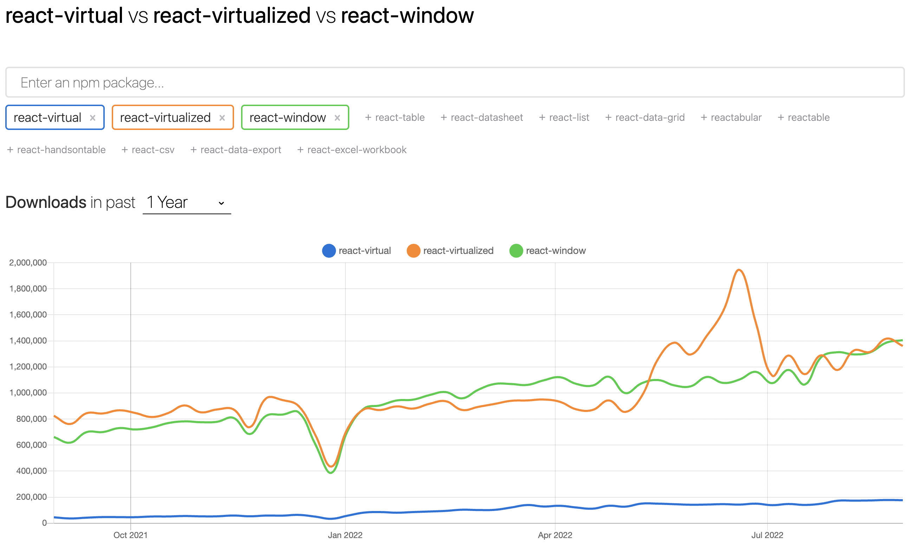
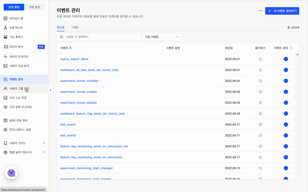
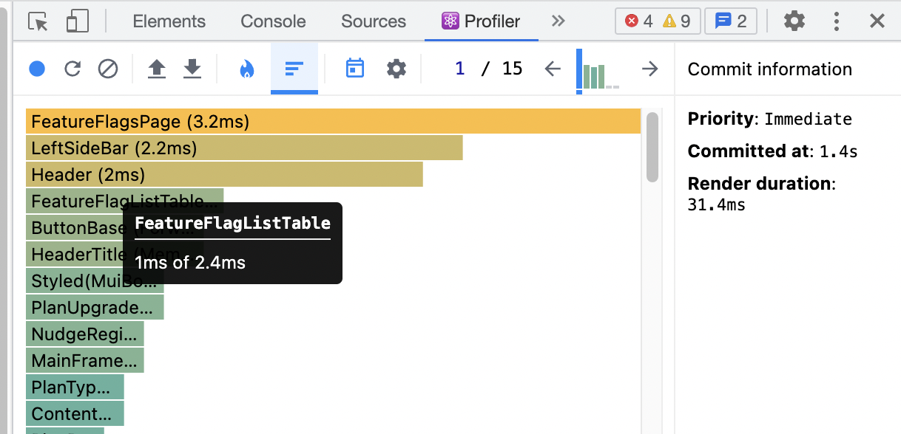

## Issue

현재 내가 몸 담고 있는 회사는 SDK를 통한 간편한 데이터 집계와 데이터 기반 의사결정을 도와주는 대시보드 서비스를 제공한다. 서비스 내에서는 연동한 SDK를 통해 이벤트 로그를 보내면 대시보드에서 해당 로그를 확인할 수 있는 구조로 되어 있는데, 문제는 대시보드 화면에 보이는 로그가 점점 많아질수록 대시보드의 반응 속도는 현저히 느려져서 대형 고객사들이나 개발, 테스트를 위해 제품을 가장 활발히 사용하는 우리 팀 또한 불편함을 겪고 있었다는 것이다. 때문에 이 부분을 개선할 필요가 있었고 우선 다음과 같이 제품의 구현 상황과 해결해야할 문제를 정리해보았다.

<br />

### AS-IS

- 기존의 구현 방식은 api를 통해 로그 전체 목록을 한번에 가져오고 이 목록을 그대로 리스트 컴포넌트로 만들어 화면에 노출한다.
- 전체 목록을 서버에서 받아오는 시간보다 **받아온 상태를 렌더링하는 시간이 성능에 더 직접적인 영향을 끼치고 있다.**
- 목록 내의 개수가 늘어날 때마다 리스트를 화면에 노출하기까지 걸리는 시간은 점점 늘어난다.

### TO-BE

- 사용자로 하여금 리스트를 화면에 보여주기까지 오래 걸린다고 느끼지 않게 하고 싶다.

<br />

위와 같이 문제 상황을 정리해보니, 단순히 리스트를 보여주기 전까지 로딩 인디케이터를 적용하기보다 렌더링에 소요되는 시간 자체를 줄이는 게 좀 더 본질적인 해결책이라는 생각이 들었다.

리스트 컴포넌트의 렌더링 속도를 최적화하기 위해서는 주로 리스트의 아이템을 쪼개서 보여줄 수 있는 페이지네이션, 무한 스크롤 기법을 떠올릴 수도 있다. 하지만 이러한 방식은 백엔드 쪽의 코드도 수정해야 하는데, 문제를 마주할 당시 팀 내 백엔드의 리소스가 충분하지 않았을 뿐더러 서버의 응답 속도는 크게 고려할 문제가 아니었기에 가급적 프론트 영역 안에서 처리할 수 있는 방안이 필요했다. 때문에 내가 선택한 대안은 Virtual Scroll 방식을 프로젝트에 도입하는 것이었다.

Virtual Scroll은 **리스트 전체 엘리먼트 높이의 합을 가진 빈 컨테이너 안에서 유저가 볼 수 있는 뷰포트에 필요한 만큼만 렌더링해서 보여주자**는 컨셉을 가지는 최적화 기법이다. Infinite Scroll의 컨셉이 '사용자의 스크롤이 최하단으로 도달할 때마다 새로운 목록을 lazy하게 불러와 채워넣는 방식'이라면 Virtual Scroll은 이미 클라이언트에서 가지고 있는 수천 개의 엘리먼트를 어떻게 하면 효율적으로 보여줄 수 있을지를 고민한 결과라고 볼 수 있다.

위에서 정리한 AS-IS 상황에도 적합한 방법이었기에 곧바로 세부적인 구현 사항과 라이브러리를 찾아보기 시작했다.

## 라이브러리 탐색

[npm trends](https://npmtrends.com/)에서 확인해보면 비교적 대중적으로 사용되는 라이브러리는 크게 `react-virtual`, `react-window`로 나뉘는 걸로 보였다. 그래서 이 두 개의 선택지로 추린 다음, 현재 프로덕트의 코드 베이스를 크게 해치지 않고 임팩트를 낼 수 있는 관점으로 라이브러리의 각 특징을 좀 더 면밀히 살펴보았다.



- react-virtual (https://react-virtual.tanstack.com/docs/api)
  - gzipped size - 2.3kb
  - vitualize 기능을 지원하는 hook 제공
  - 사용자 친화적인 가이드 문서 제공 (개인적인 관점)
- react-window (https://react-window.vercel.app/#/examples/list/fixed-size)
  - gzipped size - 6.3kb (react-virtualized의 경량화 버전)
  - virtualize 기능을 지원하는 컴포넌트 제공
  - 도입 시점에서 가장 대중적으로 사용되고 있음

위와 같은 특징들을 정리해보고 테스트용 코드도 몇번 작성해 본 뒤에 스스로 `react-virtual`을 사용하는 것이 좋겠다는 판단을 내렸다. 그 이유로는,

- 코드를 제로 베이스부터 짜는 게 아니라 기존 코드 베이스를 점진적으로 수정했어야하는 상황이었기에 컴포넌트 형태보다 hook 형태의 라이브러리를 좀 더 빠르고 유연하게 활용할 수 있을 것 같았다.
- `react-window`가 대중적이고 오래된 도구라 보다 다양한 기능을 제공하고 있었지만, 해결하려는 문제만 보자면 `react-virtual`로 충분히 대응이 가능했고 번들 사이즈도 작았다.

## 구현

이해를 돕기 위해 실제 프로덕션 코드에서 라이브러리 적용 부분만 발췌하여 옮겨둔 코드다. 하단의 코드와 같이 `useVirtual` 훅에 리스트 아이템에 관한 정보를 설정하면 반환받은 값을 컴포넌트에 적용하여 손쉽게 Virtual Scroll을 구현할 수 있다.

```tsx
const LIST_HEIGHT = 300;
const LIST_ROW_HEIGHT = 36;

const EventList = () => {
  const { events } = useEvents();
  const scrollContainerRef = useRef<HTMLDivElement>(null);

  const { totalSize, virtualItems } = useVirtual({
    size: events.length, // 리스트 아이템의 개수
    parentRef: scrollContainerRef, // 리스트 wrapper 영역의 ref
    estimateSize: useCallback(() => LIST_ROW_HEIGHT, []), // 각 리스트 아이템의 높이
    overscan: 5, // 뷰포트를 제외한 위, 아래 영역에서 미리 렌더링할 아이템의 개수
  });

  // 하단 컴포넌트의 inline style은 라이브러리에서 권고하는 스타일로 그대로 넣어주는 것이 좋다.
  return (
    <div
      ref={scrollContainerRef}
      style={{
        maxHeight: LIST_HEIGHT,
        overflow: 'auto',
      }}
    >
      <ul
        style={{
          height: totalSize,
          position: 'relative',
        }}
      >
        {virtualItems.map((virtualRow) => {
          const event = events[virtualRow.index];

          return (
            <li
              key={event.id}
              style={{
                position: 'absolute',
                top: 0,
                left: 0,
                height: `${virtualRow.size}px`,
                transform: `translateY(${virtualRow.start}px)`,
              }}
            >
              <EventRow event={event}>
            </li>
          );
        })}
      </ul>
    </div>
  );
};
```

## 결과

<figure>
  
  <figcaption align="center"></figcaption>
</figure>

<br />



<br />

라이브러리 도입 후, 리스트에 최대 10만 개까지 넣어 측정해보았을 때 렌더링에 소요되는 체감 시간이 짧아졌을 뿐 아니라, Profiler 측정 결과에서도 유의미한 성능 지표를 확보할 수 있었다.

## References

- [Virtual and Infinite Scrolling in React](https://medium.com/@alvinnguyen116/virtual-and-infinite-scrolling-in-react-d56a05976cd2#:~:text=Virtual%20and%20Infinite%20Scrolling%20are,waits%20to%20load%20more%20content.)
